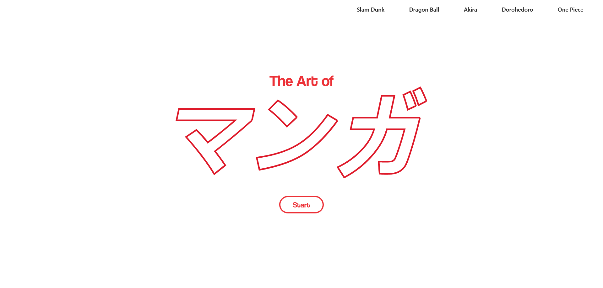

## Dynamic Transitions
This is a task made specifically for the storyteller path in Expert Lab.
I made a little website around the art of manga while trying FramerMotion and TypeWriteJS. 
## Screenshots




## Documentation

[Framer Motion](https://www.framer.com/motion/)

[TypewriterJS v2](https://www.npmjs.com/package/typewriter-effect)

[Tailwind](https://tailwindcss.com/docs/)


## Authors
- [Joachim Hamraoui](https://github.com/JoachimHamraoui)


## 🔗 Links
[](http://www.joachimhamraoui.com)
[](https://www.linkedin.com/in/joachim-hamraoui-6950b6173/)


## Run Locally

Clone the project

```bash
  git clone https://github.com/JoachimHamraoui/dynamic-transitions.git

Go to the project directory

```bash
  cd dynamic-transitions/transitions
```

Install dependencies

```bash
  npm install
```

Start the server

```bash
  npm run dev
```


## Tech Stack

**Client:** React, Vite, TailwindCSS

